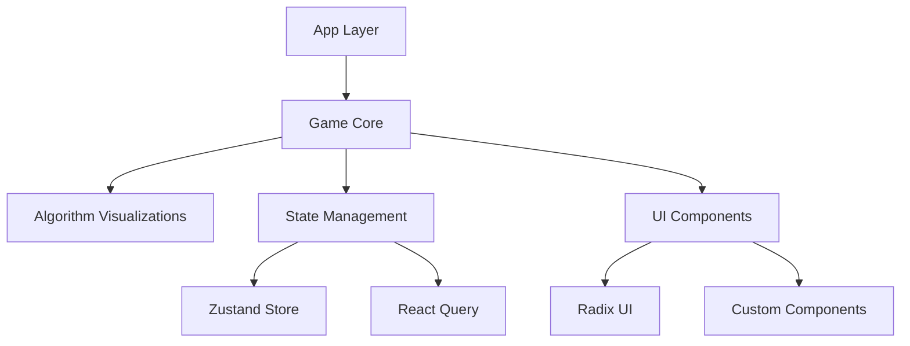

🐍 SNALGO: An OG snake game with integrated algorithms!
=================================================

[](https://nextjs.org/)
[](https://www.typescriptlang.org/)
[](https://tailwindcss.com/)
[](https://github.com/pmndrs/zustand)
[](https://supabase.com)
[](https://www.postgresql.org/)

> 🎮 OG Snake Game + 🧮 Algorithm Visualizations = 🌟 Mind-Bending Fun!

Ever wondered what would happen if the classic Snake game had a caffeine overdose and decided to teach computer science? Welcome to SNALGO - where pixels meet algorithms, and nostalgia gets a PhD upgrade! 🚀

## 🌟 Features

- 🐍 Classic snake mechanics with a modern twist
- 🎯 Real-time algorithm visualization (TSP, Knapsack)
- 🌈 Stunning retro-futuristic UI with pixel-perfect animations
- 🎵 Immersive sound effects and background music
- 📱 Fully responsive design with mobile controls
- 🏆 Global leaderboard system
- 💎 Collectible system with inventory management
- 🔋 Level progression with increasing complexity

## 🛠️ Tech Stack

### Core
- **Next.js 15.2.1** - React framework with App Router
- **TypeScript** - Type-safe development
- **Zustand** - State management with zero drama
- **React Query** (@tanstack/react-query) - Server state management

### UI/UX
- **Tailwind CSS 4.0.9** - Utility-first styling
- **Radix UI** - Headless UI components
- **Framer Motion** - Smooth animations
- **Lucide React** - Beautiful icons
- **Sonner** - Toast notifications
- **class-variance-authority** - UI variants
- **clsx & tailwind-merge** - Class utilities

### Sound & Visuals
- **Howler.js** - Audio management
- **Recharts** - Data visualization
- **Embla Carousel** - Touch-friendly carousels

### Forms & Validation
- **React Hook Form** - Form management
- **Zod** - Schema validation
- **input-otp** - OTP input fields

### Data & Storage
- **Supabase** - Backend as a Service
- **UUID** - Unique identifiers

### Tooling
- **ESLint** - Code linting
- **Next Themes** - Dark mode support
- **React Dev Tools** - Development tooling

## 🚀 Quick Start

1. **Clone and Install**
   ```bash
   git clone <your-repo-url>
   cd snalgo
   npm install
   ```

2. **Fire up the Development Server**
   ```bash
   npm run dev
   ```

3. **Open [http://localhost:3000](http://localhost:3000)**
   Get ready to be amazed! 🌈

## 🎮 Game Controls

- **⬆️ ⬇️ ⬅️ ➡️** Arrow keys for movement
- **H** Toggle path optimization
- **Mobile:** Touch controls with visual feedback

## 🧪 Algorithm Showcase

- **Traveling Salesman (TSP)** - Path optimization
- **Knapsack Problem** - Inventory management
- **Bubble Sort** - Inventory sorting
- **Linear Search** - Item finding

## 🎨 Design Philosophy

SNALGO combines retro gaming aesthetics with modern UI principles:
- Pixel-perfect animations
- Neon-infused color palette
- Responsive grid system
- Immersive sound design
- Cyberpunk-inspired visuals

## 🌐 Architecture



## 🤝 Contributing

Got ideas? Found a bug? Let's make SNALGO even better!
1. Fork it
2. Create your feature branch
3. Commit your changes
4. Push to the branch
5. Create a new Pull Request

## 📜 License

MIT - Go wild! Just remember to give credit where it's due. 🙌

##

- Built with ❤️ using Next.js and an unhealthy amount of coffee ☕
